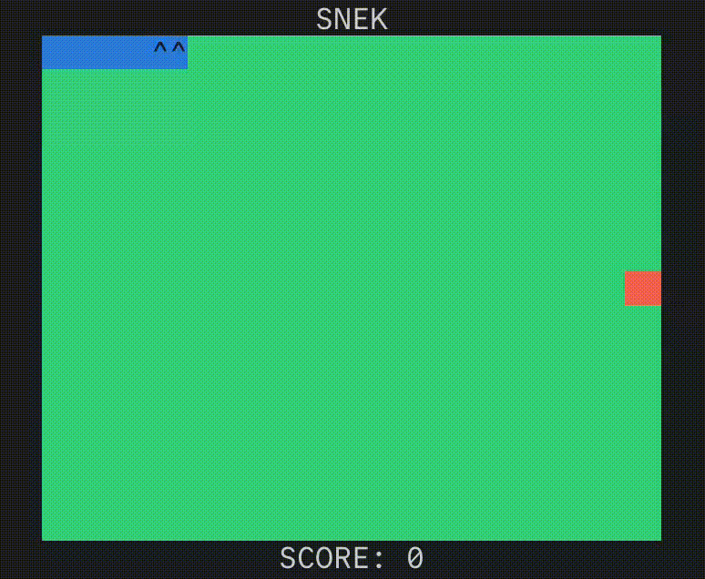

# snek

*A Rust terminal snake game written in a couple hours*

---

This snake game uses console_engine (which internally relies on crossterm) to run on the terminal, it has pretty basic controls, colors, the ability to pause, a one-frame death animation for some reason, a title at the top, and a score. I think I made the code nice enough.
